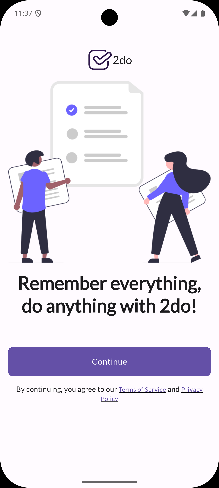
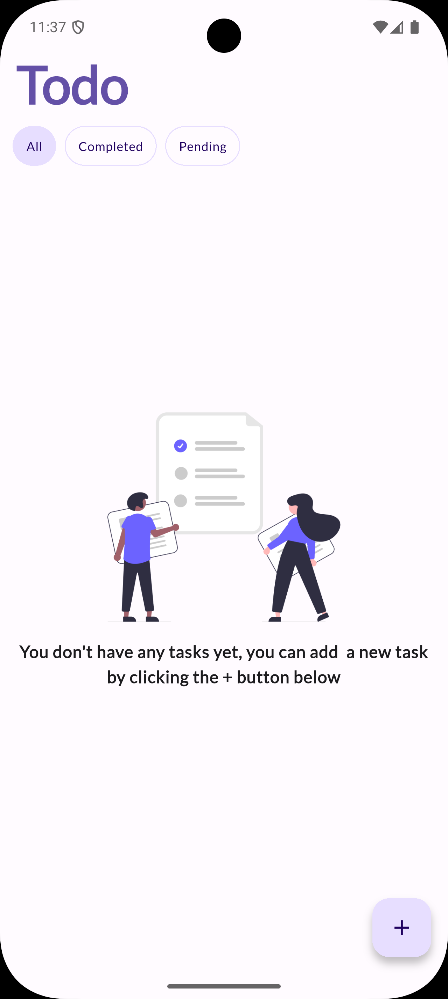
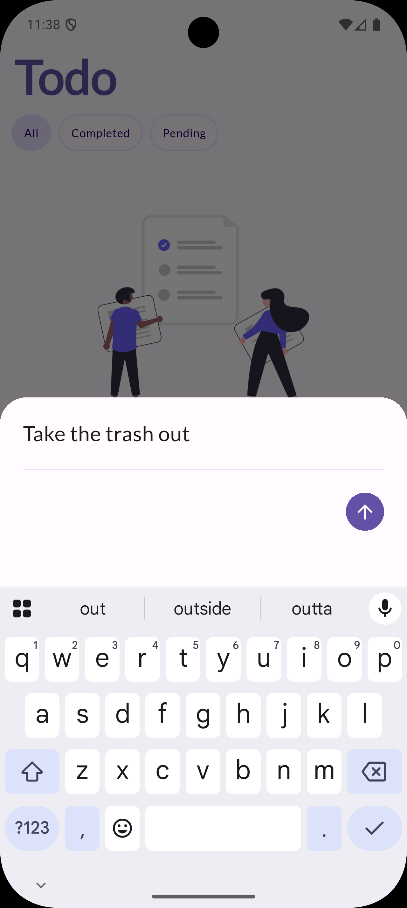
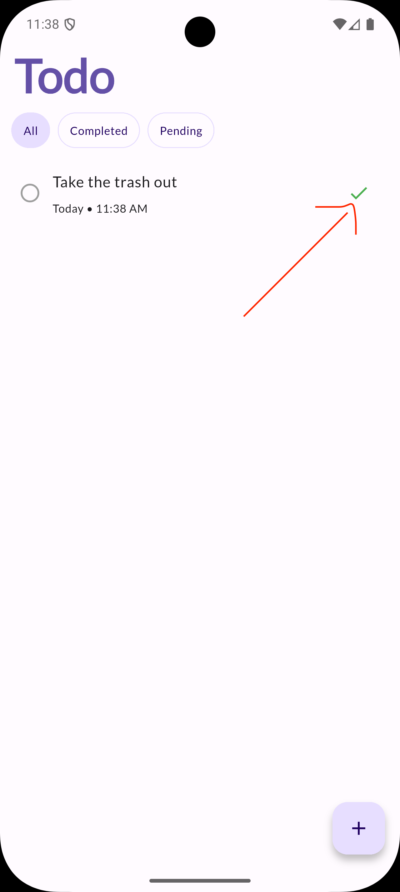
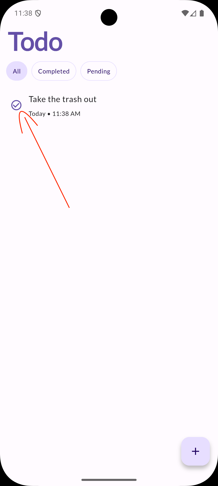
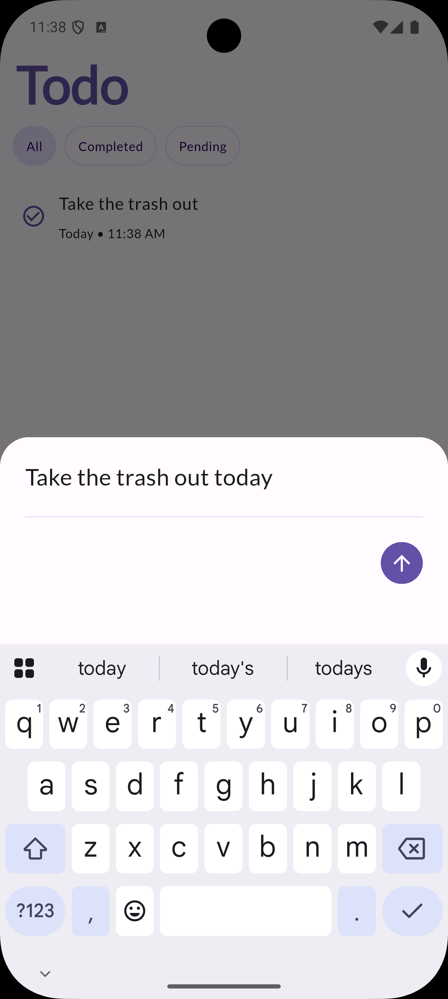

# Todo App

A Todo Application built with Flutter that helps you manage your daily tasks
efficiently.

## 📱 Features

- **Landing Page**: Clean and intuitive welcome screen
- **Task Management**: Add, edit, and delete todo tasks
- **Task Status**: Mark tasks as complete or incomplete
- **Empty State**: Beautiful empty state when no tasks are present
- **Responsive Design**: Works seamlessly across different screen sizes
- **Local Storage**: Tasks are stored locally using SQLite database

## 📸 Screenshots

### Landing Page



### Home Page (Empty State)



### Add Todo Task



### Complete Task View



### Uncomplete Task View



### Edit Task View



### Delete Task View


## 🎥 Demo Video

Check out the demo video to see the app in action:

[Demo Video](assets/screenshots/2do%20Demo%20Video.MP4)

## 📱 Download

Download the latest version of the Todo App:

- **Android
  **: [Download APK](https://github.com/abcdOfficialzw/todo/tree/main/releases)
- **iOS**: Available on the App Store (coming soon)

## 🛠️ Built With

- **Flutter**: UI framework for building natively compiled applications
- **Dart**: Programming language optimized for building mobile, desktop, server, and web
  applications
- **Floor**: Local database for storing todo tasks
- **Provider & BLoC**: State management
- **Material Design**: Google's design system for intuitive and beautiful user interfaces

## 🚀 Getting Started

### Prerequisites

- Flutter SDK (3.29.0+)
- Dart SDK
- Android Studio / VS Code
- iOS Simulator / Android Emulator

### Installation

1. Clone the repository:
   ```bash
   git clone https://github.com/abcdOfficialzw/todo
   ```

2. Navigate to the project directory:
   ```bash
   cd todo
   ```

3. Install dependencies:
   ```bash
   flutter pub get
   ```

4. Run the application:
   ```bash
   flutter run
   ```

## 📁 Project Structure

```
lib/
├── app/
│   └── home/          # Home screen and related components
├── database/          # Database configuration and models
├── utils/            # Utility functions and themes
├── app_manager.dart  # Application state management
├── landing_page.dart # Landing page implementation
├── main.dart         # Application entry point
└── routes.dart       # Application routing
```

## 📄 License

This project is licensed under the MIT License - see the [LICENSE](LICENSE) file for details.

## 📞 Contact

- GitHub: [@abcdOfficialzw](https://github.com/abcdOfficialzw)
- Email: takudzwa@takutitus.me

---

Made with ❤️ using Flutter
